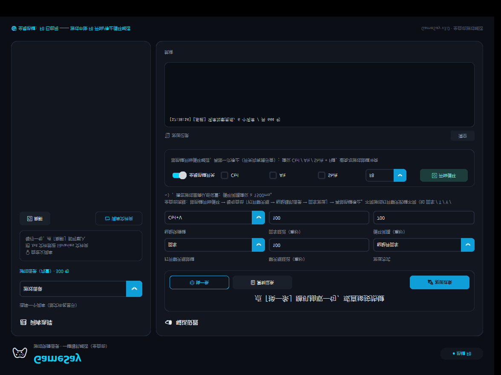

<div align="center">

# 🎮 GameSay · 游戏快捷语录助手

### 一键全自动循环喊话 · 按一下，随机语录自己说个不停 ✧(≖ ◡ ≖✿)

`Python 3.10+` ㅤ`Windows` ㅤ`customtkinter` ㅤ`零账号依赖`

**在游戏里按一个热键，语录就像连珠炮一样自动发出去，再按一下，世界安静了 (๑•̀ㅂ•́)و✧**

[✨ 功能](#-功能) ㅤ[🚀 快速开始](#-快速开始) ㅤ[📚 词库一览](#-词库一览) ㅤ[⚙️ 自定义词库](#️-自定义词库) ㅤ[🔬 原理](#-原理) ㅤ[🧪 测试](#-测试)

---

</div>

## ✨ 功能

- 🎯 **全局热键循环开关** —— 按热键开始，再按停止，游戏中全屏也有效（开关有提示音：开启「叮咚↑」/ 关闭「咚哒↓」）
- 🤖 **全自动流程** —— 自动「打开聊天框 → 粘贴随机语录 → 回车发送」，无需切出游戏 (｡•̀ᴗ-)✧
- 🗂️ **词库按文件管理** —— 下拉框直接显示文件名，丢个 `.txt` 进文件夹就是新词库
- 🎀 **636 句内置语录** —— 卖萌 / 自嘲 / 夸夸 / 互怼 / 吐槽，全部带颜文字 (*≧▽≦)
- ⌨️ **完全可自定义** —— 打开聊天框按键、各步延迟、粘贴快捷键、组合热键，随心配
- 🖥️ **暗色电竞风界面** —— customtkinter 圆角卡片 + 青色霓虹点缀，颜值在线

<div align="center">



</div>

## 🚀 快速开始

```powershell
# 1. 安装依赖（仅需 customtkinter）
pip install customtkinter

# 2. 运行
python game_say.py
```

或者直接双击 `启动游戏快捷语录.bat`（首次运行自动装依赖）(・ω・)ノ

### 📖 使用三步走

| 步骤 | 操作 |
|---|---|
| 1️⃣ | 选择词库（下拉框直接显示文件名） |
| 2️⃣ | 配置流程：**打开聊天框按键**（回车 / T / Y / ~）、聊天框延迟、发送方式、循环间隔 |
| 3️⃣ | 勾选「全局热键开关」，选好组合键（默认 F8） |

进游戏，**按热键 → 循环开始（🔔 提示音）→ 再按热键 → 循环停止（🔕 提示音）** ٩(◕‿◕｡)۶

## 📚 词库一览

| 词库 | 句数 | 类型 | 风格 |
|---|:---:|:---:|---|
| 🎀 游戏语录 | 300 | 内置 | 卖萌 / 自嘲 / 夸夸 / 互动 / 耍赖 / 元气 |
| 😼 可爱怼人 | 100 | 自定义 | 萌系怼对手：「略略略，打不到我打不到我」 |
| 🧐 机智吐槽 | 100 | 自定义 | 毒舌但文明：「预判了个寂寞」 |
| 🐣 俏皮互怼 | 100 | 自定义 | 卖萌式回击：「反弹反弹！全部反弹给你」 |
| 🌟 夸夸队友 | 24 | 自定义 | 彩虹屁拉满 |
| 🥺 求饶卖萌 | 20 | 自定义 | 认怂保命流 |

## ⚙️ 自定义词库

把 `.txt` 文件丢进 `libraries` 文件夹，**每行一句**，`#` 开头为注释，点「🔄 刷新」即载入：

```text
大佬带带人家嘛～我超乖的 (๑˃̵ᴗ˂̵)و
求带飞！我负责萌死对面 (◕ᴗ◕✿)
```

## 🔬 原理

```
热键按下 → 模拟「打开聊天框按键」→ 写入剪贴板 → SendInput 模拟粘贴 → 回车发送
```

- 字母/数字键用**扫描码**发送，兼容 DirectInput 类游戏
- 模拟按键后 0.6s 抑制窗口，防止注入键误触发热键
- 循环使用启动时的词库与参数**快照**，运行中改设置不影响本次循环
- 配置保存在 `config.json`，无任何敏感信息 (￣▽￣)~*

## 🧪 测试

| 测试 | 内容 | 结果 |
|---|---|---|
| `smoke_test.py` | 词库 / 参数 / 热键 / 循环开关 / 提示音 | ✅ 10/10 |
| `test_hotkey_e2e.py` | 组合热键 + 抑制机制（真实按键模拟） | ✅ 5/5 |
| `test_notepad_e2e.py` | 剪贴板 → 粘贴 → 回车全链路 | ✅ |
| `test_full_loop.py` | F8 开循环 → 连续送达 → F8 停止零新增 | ✅ |

## 📦 项目结构

```text
GameSay/
├── game_say.py              # 主程序（暗色电竞风 UI）
├── hotkey.py                # 全局热键（纯 ctypes，支持组合键）
├── keysim.py                # 剪贴板 + SendInput 按键模拟
├── data/游戏语录.txt        # 内置 300 句可爱语录
├── libraries/               # 自定义词库文件夹（.txt 即插即用）
├── 启动游戏快捷语录.bat     # 一键启动（自动装依赖）
└── preview.png              # 界面预览
```

## ⚠️ 温馨提示

> 请遵守游戏规则与聊天规范，控制发送频率，适度娱乐。
> 该工具仅用于朋友间开黑互动，请勿用于骚扰他人 (｡•́︿•̀｡)

## 📄 License

MIT © GameSay ٩(๑❛ᴗ❛๑)۶
